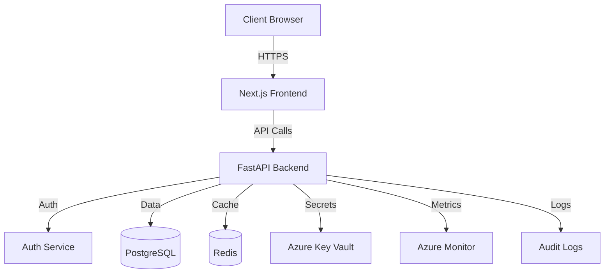

# AzureShield IAM Architecture Overview

## System Architecture

AzureShield IAM follows a modern, microservices-based architecture with the following key components:

### 1. Frontend Layer
- **Next.js Application**
  - Server-side rendering for improved performance
  - Client-side routing with dynamic imports
  - Material-UI components for consistent design
  - React Context for state management
  - TypeScript for type safety

### 2. Backend Layer
- **FastAPI Service**
  - RESTful API endpoints
  - OpenAPI documentation
  - JWT-based authentication
  - Role-based access control
  - Attribute-based access control
  - Comprehensive audit logging

### 3. Data Layer
- **PostgreSQL Database**
  - User management
  - Role and permission storage
  - Audit log storage
  - Policy definitions
  - System metrics

- **Redis Cache**
  - Session management
  - Rate limiting
  - Temporary data storage
  - Performance optimization

### 4. Infrastructure Layer
- **Azure Cloud Services**
  - Azure Kubernetes Service (AKS)
  - Azure Container Registry (ACR)
  - Azure Database for PostgreSQL
  - Azure Key Vault
  - Azure Monitor
  - Azure Application Gateway

### 5. Security Layer
- **Authentication & Authorization**
  - Multi-factor authentication
  - OAuth 2.0 / OpenID Connect
  - JWT token management
  - Role-based access control
  - Attribute-based access control
  - Session management

- **Security Features**
  - Rate limiting
  - IP blocking
  - Audit logging
  - Security alerts
  - Compliance monitoring

## Component Interaction

## Security Architecture

### 1. Authentication Flow
1. User credentials validation
2. MFA verification (if enabled)
3. JWT token generation
4. Refresh token management
5. Session tracking

### 2. Authorization Flow
1. Token validation
2. Role verification
3. Permission checking
4. Policy evaluation
5. Access decision

### 3. Audit Trail
1. Event capture
2. Log enrichment
3. Storage in database
4. Archive management
5. Compliance reporting

## Scalability Design

### 1. Horizontal Scaling
- Stateless application design
- Load balancing
- Container orchestration
- Database sharding

### 2. Performance Optimization
- Caching strategies
- Database indexing
- Query optimization
- Connection pooling

### 3. High Availability
- Multi-region deployment
- Failover mechanisms
- Backup strategies
- Disaster recovery

## Monitoring & Observability

### 1. Metrics Collection
- System performance
- User activity
- Security events
- Resource utilization

### 2. Logging Strategy
- Structured logging
- Log levels
- Log rotation
- Log analysis

### 3. Alerting System
- Threshold-based alerts
- Anomaly detection
- Incident response
- Escalation procedures

## Deployment Architecture

### 1. Development Environment
- Local development setup
- Docker containers
- Development databases
- Mock services

### 2. Staging Environment
- Azure Dev/Test environment
- Automated testing
- Performance testing
- Security scanning

### 3. Production Environment
- Azure production environment
- Blue-green deployment
- Canary releases
- Rollback procedures

## Compliance & Standards

### 1. Security Standards
- OWASP Top 10
- NIST guidelines
- ISO 27001
- GDPR compliance

### 2. Code Standards
- PEP 8 (Python)
- ESLint (JavaScript)
- TypeScript strict mode
- Documentation requirements

### 3. Testing Standards
- Unit testing
- Integration testing
- End-to-end testing
- Security testing
- Performance testing 